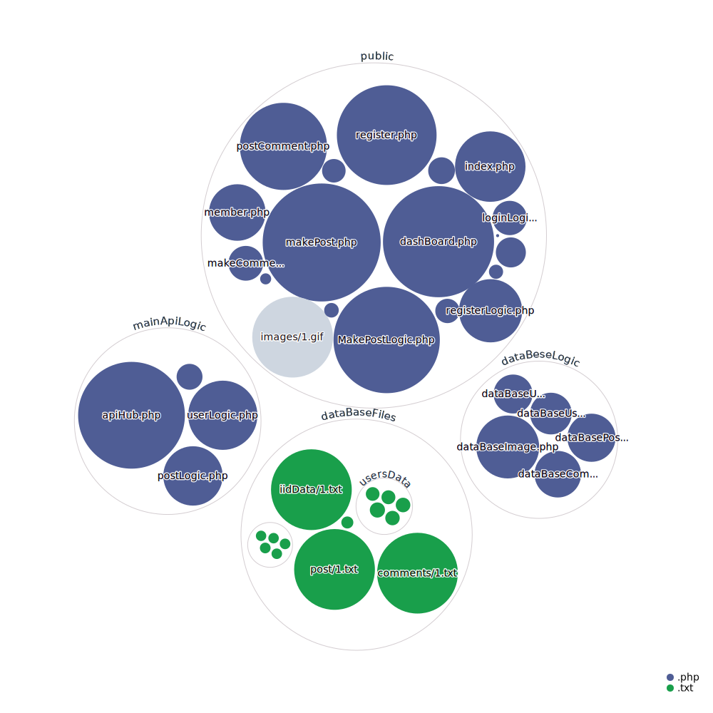

# Wits_hjemmeSide_ogServer
hej 

Servern samt php compileren bliver lavet aoutomatisk via dockercompose, så der er to containere, "Servern=Nginx image" og "Compileren=Php:fpm image"

For sætte det op kræver det at man har docker compose. 

(1.) Installer docker desktop, hvis man ikke allerede har det.
ps det virker selvfølige også hvis man køre docker engien på en linux native/vm, her skal man bare manuelt sørge for man har compose til docker.  

1. Extract til c/

2. Åben terminalen på maskinen, gå ind i mappen (cd C:\Wits_hjemmeSide_ogServer) og her skriver man så "docker compose up". 

3. Gå ind på hjemme siden via localhost:80/127.0.0.1. (hvis det ikke virker, så tjek om port 80 er fri).   
 
4. Man kan sagten åben samt redigere php filerne, mens serveren køre, man behøver heller ikke genstarte.

ps der er ingen billeder på de test post der allerede er, dette er fordi den adresse de for når de bliver gemt er via $_SERVER[HTTP_HOST] (og fordi jeg har slettet dem så fil størelsen ikke er så slem, men hvis man laver et nyt post,(på sin egen server) "burde" man kunne se det.(tjek iid data filerne, om den ip adresse de bliver "gemt under" (url vej til hvor de bliver gemt) er den samme som i åbne siden på). 
   

jeg har lavet noget test acounts som man kan bruge, hvis man ikke gider laver nye. 

username: admin

pasword: 123

username: test 

pasword: test

